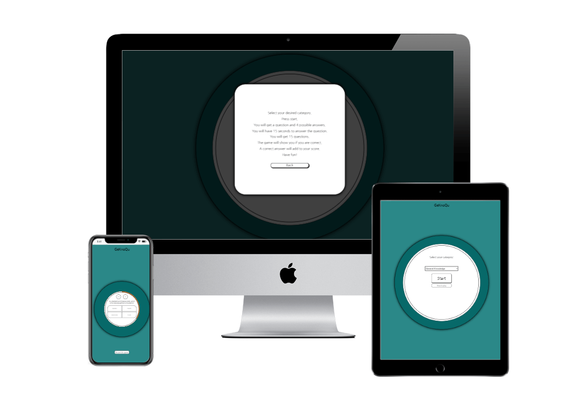

# GeKnoQu!

# Introduction

Welcome to the GeKnoQu! The place to test your **Ge**neral **Kno**wledge in a **Qu**iz!

Ranging categories from sports to mythology to music, for every taste there is something. Or you could go with everything in one with the general knowledge option! Using the API from [Opentdb](#https://opentdb.com/) this quiz app has over 4000 verified questions to test your knowledge!

Thank you for visiting this project! For any feedback and/or questions you can always contact me via GitHub!

~ Robert L. Z.

# Table of Content
- [User Experience](#user-experience)
  * [Site Owner Goal](#site-owner-goal)
  * [User Goals](#user-goals)
  * [User Stories](#user-stories)
  * [User Requirements](#user-requirements)
  * [User Expectations](#user-expectations)
  * [Design Choices](#design-choices)
  * [Wireframes](#wireframes)
- [Features](#features)
  * [Existing Features](#existing-features)
  * [Future Features](#future-features)
- [Technologies](#technologies)
  * [Languages](#languages)
  * [Libraries and Tools](#libraries-and-tools)
- [Testing](#testing)
- [Deployment](#deployment)
  * [Deployment via GitHub Pages](#deployment-via-github-pages)
  * [Deployment of the website locally:](#deployment-of-the-website-locally-)
- [Credits](#credits)
  * [API](#api)
  * [Code](#code)
  * [Thanks](#thanks)
  * [Afterword](#afterword)

# User Experience
## Site Owner Goal 
* Having users to play a small game of a multiple choice quiz, on a broad scale of subjects.
* For users to have fun and learn something at the same time.

---

## User Goals
* A website where you can play a multiple choice quiz game.
* A website that is easy to use on and has good responsiveness on all screen sizes.
* An explanation on how to play the game and if there are any rules to it.
* In game:
    * To see whether a given answer is correct or wrong.
    * To see how many answers were answered correctly. Ie score.
    * To see how many questions are there still to go/on which question out of total amount of questions the user is.
    * ~~To see the score.~~

---

## User Stories
As a user;
* I want a website which is easy and intuitively to use.
* I want to see what the website is about at first glance. 
* I want a website that works on all screen sizes.
* I want to know how to play the game.
* I want to select the category of the questions.
* I want to see how much time I have left to anser the question.
* I want to know if an answer is correct or wrong.
* I want to know how far along I am on the questionaire/quiz.
* I want to my see my score.
* I want to play the game again.

[Back to top](#table-of-content)

---

## User Requirements
* Intuitively know how to start the game or to see how to play the game.
* Able to select the category of questions.
* A time indicator.
* Feedback on whether a question is correct or wrong.

---

## User Expectations
User expects: 
* the navigation on the site to be working properly.
* to find on how to play the game.
* to see how far along the user is on the quiz.
* to be able to select a category.
* to known how much time the user has left to answer the question.
* feedback on if the given answer is correct or wrong.
* the correct answer to be shown.
* upon giving the correct answer that it increases to score. 
* to see the users final score on the end of the quiz.

[Back to top](#table-of-content)

---

## Design Choices
The goal of this site is that users can play a quiz/questionaire game. Therefore the user should immediately see the way to start to game or to see how to.

### The structure
~~For the structure of the website I will use the framework [Bootstrap](https://getbootstrap.com/ "Link to bootstrap").
This framework allows for a proper responsive website which is build up from a mobile-first perspective.
The grid-system that Bootstrap provides is very usefull to have a well working responsive website.
Furthermore Bootstrap has a wide browser compatibility, is quite easy to use and is very customizable.~~

For the structure of the website I wil use my own css style sheet. It still will be build up from a mobile-first perspective and should be responsive to different screen sizes. This because there will not be many elements that requires the responsiveness benefits of bootstrap.

### Fonts
During the quiz there will be a time restraint, therefore a simple but well readable font is necessary.
I will be using a font from [Google Fonts](https://fonts.google.com/ "Google Fonts"), specifically the [Nanum Gothic](https://fonts.google.com/specimen/Nanum+Gothic "Nanum Gothic").
An easy to read, compact, professional looking font.

### Colours

As this game has a 'correct' and 'incorrect', a green and a red colour respectively, the initial colours should be more on the neutral side. It should also go easy on the eyes as concentation is needed to answer the questions of the quiz.

The primary colours in this pallette:

* ~~#AF0B0B "Red", Will serve as the colour indicating incorrect.~~
* ~~#098C09 "green, ", will serve as the colour indicating correct.~~
* #076969 "blue", will serve as the neutral colour. Neither correct or incorrect. It is also a colour that is easy on the eyes and could therefore be used as the background.
* ~~#AF550b "Orange" Supplementary colour. Possible use for buttons and/or the timer bar.~~

Colour pallette comes with complementary colours, which might be deviated to if it fits the purpose better.

* #2B8888 is used as main background colour, where #076969 will be used as the neutral colour in the feedbackcircle.
* #D41C1C is used as the incorrect feedback colour.
* #3AB53A is used as the correct feedback colour.

* #D46F1C will be used instead of #AF550b, as it a bit more bright and contrasts better with the background and the neutral colour.

[Back to top](#table-of-content)

## Wireframes
I have made wireframes for the sizes Mobile, Tablet and Desktop.
As per Bootstrap order, from small to large. To make the wireframes I have used the program [Balsamig Wireframes](https://balsamiq.com/wireframes/ "Link to Balsamig Wireframes").
* [Mobile Wireframe Start](/wireframes/mobile-start.png)
* [Mobile Wireframe During Question](/wireframes/mobile-during-question.png)
* [Mobile Wireframe Play Again](/wireframes/mobile-play-again.png)
* [Mobile Wireframe How To Play](/wireframes/mobile-how-to-play.png)
* [Tablet Wireframe Start](/wireframes/tablet-start.png)
* [Tablet Wireframe During Question](/wireframes/tablet-during-question.png)
* [Desktop Wireframe Start](/wireframes/desktop-start.png)
* [Desktop Wireframe Druing Question](/wireframes/desktop-during-question.png)

[Back to top](#table-of-content)

---
---

# Features
## Existing Features
### Category Select and Start

On page load you will see a category selector and the start button.
The category selector fetches the possible categories from [opentdb.com](https://opentdb.com "Link to open trivia database"), where then one of the categories can be selected. Upon selecting a category and pressing start, the interface will collapse and move to the game fase.

### Help Modal

Below the starting area, there is a link on **how to play**. This will popout a modal, explaining the basics of the game. Upon clicking on the back button or next to the modal, it will disappear.

### Loading Beneath The Collapse

When start is pressed, the interface will collapse in on itself and to appear a couple of seconds later with the proper questions loaded in and the first question ready to be answered. The start button will be gone and made room for the choice buttons. The category selector will be gone and made room for the questions, the score and question counters.
The fetching of the questions will be done in the time on the collapse and reappear animation.

### Game

The game itself is about answering ~~20~~ 15 questions in the general knowledge area or of the selected category. You will be presented with a question and 4 answers. Upon selecting an answer, the button and the outer ring will turn green or red, for correct or incorrect respectively. If incorrect, the correct answer will be shown after a short while, before moving on to the next question.
The questions are made possible by the API of [opentdb.com](https://opentdb.com "Link to open trivia database").

### Score and Question Progress

During the game itself, on the top of the game interface there will be counters to show on which question you are and how many of them you have answered correctly.

### Restart alert

When the game has started, it is assumed that you have read the how to play and therefore this link has been replaced with a button to restart the game. Upon clicking you will receive an alert which asks you if you are realy sure to exit the game and return to the main menu. It is asked if you are sure, because it might be a missclick. When clicked on **OK**, the game will return to the main menu.

[Back to top](#table-of-content)

---

## Future Features
### High Score

It would be interesting to see how well you scored the last couple of times and also the user would then have a score to beat. This could be done locally.

### Versus

It could be fun to do a versus where all participants fill out there name before hand and then go against eachother. Different rules could be interesting, where a correct answer for player A would cost player a point. Both starting with 5 points for example. The array of questions would need to be bigger in such an instance. The possibilities are many.

### Sound

An extra feedback for answering a question correct or incorrect could play an appropriate sound. This ofcourse should be optional for the user if the user wants to play with sound or not.

### Supportive comments

It would be nice to have a compliment system in the endgame, giving the user a witty comment as extra feedback on the score the user got.
'*Well done, you almost got a perfect score!*','*Not so good, only one correct answer...*', to name a few examples. 

### A time delay for the visually impaired

The arialabels do adapt to the content of the question and answers. However when a visual impaired user wants to play the game with help via the arialabels, the time might insufficient to answer the question. Therefore an option at the start of the game to give more time in such cases would be a good future feature.

[Back to top](#table-of-content)

# Technologies
## Languages
*   [HTML](https://en.wikipedia.org/wiki/HTML "Link to the HTML wikipedia page")
*   [CSS](https://en.wikipedia.org/wiki/CSS "Link to the CSS wikipedia page")
*   [JavaScript](https://en.wikipedia.org/wiki/JavaScript "Link to the JavaScript wikipedia page")

## Libraries and Tools
### Libraries & Frameworks
*   ~~[Bootstrap](https://getbootstrap.com/ "Link to bootstrap")~~
*   ~~[Fontawsome](https://fontawesome.com/ "Link to fontawesome")~~
*   [Googlefonts](https://fonts.google.com/ "Link to googlefonts") 
*   [Open Trivia Database](https://opentdb.com/ "Link to open trivia database")

### Tools
*   [Gitpod](https://www.gitpod.io/ "Link to gitpod")
*   [Github](https://github.com/ "Link to github")
*   [Git](https://git-scm.com/ "Link to git")
*   [Tinypng](https://tinypng.com/ "Link to tinypng") 
*   [Balsamiq Wireframes](https://balsamiq.com/wireframes/ "Link to balsamiq wireframes")
*   [W3C Css-validator](https://jigsaw.w3.org/css-validator/ "Link to the w3 css validator")
*   [W3C Markup-validator](https://validator.w3.org/ "Link to w3c markup validator")
*   [Techsini](http://techsini.com/ "techsini.com")
*   [Favicon.cc](#https://www.favicon.cc/?)

[Back to top](#table-of-content)

---

# Testing
This is done in a seperate file:

[TESTING.md](https://github.com/Zelhorst92/GeKnoQu/blob/master/TESTING.md "Link to tests and bugs file")

---

# Deployment
## Deployment via GitHub Pages
The website was deployed via GitHub by following the steps below:
-   Go to the repository you want to deply on github.
-   Click on the **Settings** tab
-   Go to **Pages** on the left side navigation
-   In the **Source** section, there is a dropdown menu; select the **master** branch and **root**. Click **save**.
-   Within a short moment the website is live.
    You will see a link on the top of the GitHub Pages section, either in a blue or green field.
    -   Example on how the **link** will look like and coincidently the link to the current website: [https://zelhorst92.github.io/GeKnoQu/](https://zelhorst92.github.io/GeKnoQu/ "Link to the deployed website")
-   Any time you will push to Github, the update will be visible after a short while.

## Deployment of the website locally:
-   Click on the dropdown menu which says **Code** on the Github Repository.
-   You will see several options; 
    -   **Clone with a link**, 
    -   **Open with GitHub Desktop** 
    -   **download ZIP**

#### Clone with a link
-   When you want to clone; use the **Clone with HTTPS option**, copy the link displayed.
-   Open your IDE and go to the terminal.
-   Change the working directory to the location where the cloned directory is to go.
-   Use the **git clone** command and paste the url copied in the second step.

#### Open with GitHub Desktop
-   If you have GitHub Desktop installed, you can click on this and it will import and clone the repository for you, after selecting where it needs to go.

#### Download the ZIP
-   You can also download the whole repository in a zip file and use the IDE software you want.

[Back to top](#table-of-content)

---

# Credits
## API

The API used is a free to use [API](https://opentdb.com/) made possible by the folks at [pixeltailgames](https://www.pixeltailgames.com/). My mentor, [Simen Daehlin](https://github.com/Eventyret "githubpage of Simen Daehlin") pointed me in the direction of this API.

## Code

### Core

The core mechanics are based on the youtube series by [James Q Quick](https://www.youtube.com/watch?v=u98ROZjBWy8&list=PLDlWc9AfQBfZIkdVaOQXi1tizJeNJipEx).It was a great start to this project and helped me understand javascript quite a bit better. I would recommend this video series to everyone starting out on javascript. 

### Timer bar

The timer bar is roughly based on [this](https://stackoverflow.com/questions/35383629/css-circle-border-fill-animation "stackoverflow forum") and [this](https://jsfiddle.net/rsfkmegp/2/ "jsfiddle") piece of code, made by [G-Cyrillus](https://stackoverflow.com/users/2442099/g-cyrillus "stackoverflow forum"). Integration with the code I already made myself was quite something to figure out, but ultimately successful.

### Collapse animation

Created with information from [W3schools Transitions](https://www.w3schools.com/cssref/css3_pr_transition.asp).

### Modal

Created with information from [W3schools Modals](https://www.w3schools.com/howto/howto_css_modals.asp).

### Other usefull videos

Other helpfull videos I used to supplement my knowledge about javascript. While I have not take code directly from these videos, they should be mentioned as an asset.

* [Video by Akshay Saini](https://www.youtube.com/watch?v=8zKuNo4ay8E)
* [Web Dev Simplified](https://www.youtube.com/channel/UCFbNIlppjAuEX4znoulh0Cw)

## Thanks

### My mentor
I would like to thank my mentor [Simen Daehlin](https://github.com/Eventyret "githubpage of Simen") for pointing me in the right direction in terms of the goals of the site. He also gave me quite a couple of pointers on how to improve my code, the order of code and how the javascript could be written easiers/simpler.

### My family and friends
I would also like to thank my family and friends for their brutally honest feedback which helped a lot to view the website from the users perspective.
They did not shy away from pointing out any flaws that I had overlooked.

## Afterword

This was quite a bit more challenging project compared to the first sole HTML and CSS project, but a lot of fun to do. I really like the fact that you can manipulate the HTML and CSS with the help of javascript and make the website more 'alive'. I am quite fond of the collapse animation.

The circular design did make me run into a few problems, as with circles you have a lot less 'real estate' to work with compared to a more angular design. As such there the space available for the questions and answer is not always optimal. If I had more time, I problably would consider a redesign. 

Overal it was enjoyable project to do.

[Back to top](#table-of-content)